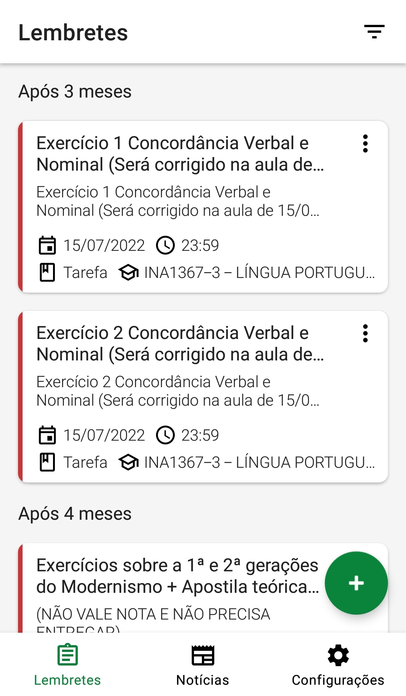
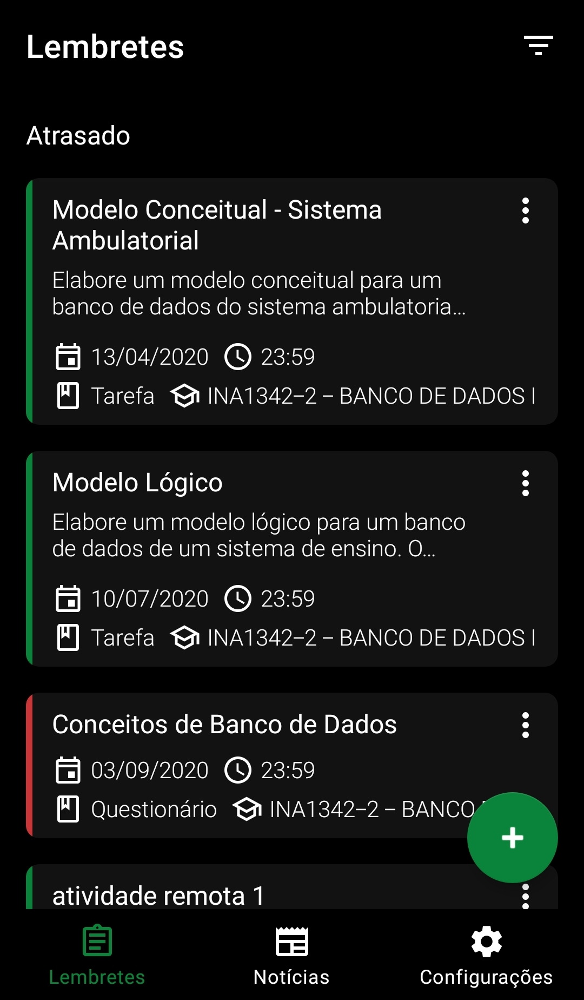
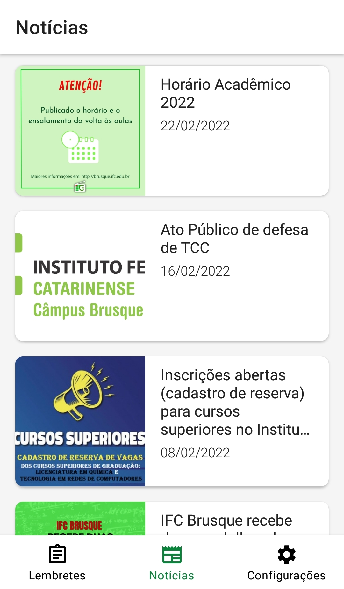

[![MIT License][license-shield]][license-url]

<!-- PROJECT LOGO -->

  **ATENÇÃO:** Este projeto não está mais sendo desenvolvido e possivelmente não funciona mais corretamente devido a mudanças no site do campus.
  
 ---
<h3 align="center">App IFC Brusque</h3>
  

    Aplicativo que integra as plataformas utilizadas pelo campus com funcionalidades que colaboram para a organização da rotina estudantil
     
  

   

### Funcionalidades

- Cadastro de lembretes na agenda
- Importação de avaliações, tarefas e questionários do SIGAA para a agenda
- Leitura das notícias do campus
- Temas claro e escuro
- Notificação de novos itens no SIGAA e de novas notícias

### Tecnologias utilizadas

* [AndroidX](https://github.com/androidx/androidx)
* [Dagger](https://github.com/google/dagger)
* [OkHttp](https://github.com/square/okhttp)
* [Okio](https://github.com/square/okio)
* [Picasso](https://github.com/square/picasso)
* [RxJava](https://github.com/ReactiveX/RxJava)
* [SIGAA for Kotlin](https://github.com/imawa/sigaa-for-kotlin)
* [Timber](https://github.com/JakeWharton/timber)
* [jsoup](https://github.com/jhy/jsoup)

<!-- ROADMAP -->
## Roadmap

Para a versão final do aplicativo, estão planejadas as seguintes abas:
- [x] Agenda
- [x] Notícias
- [x] Configurações
- [ ] SIGAA
- [ ] Rádio IFC Web

<!-- LICENSE -->
## Licença

Distribuído sob a Licença MIT. Confira LICENSE.txt para mais informações.

<!-- ACKNOWLEDGMENTS -->
## Agradecimentos

* [Best-README-Template](https://github.com/othneildrew/Best-README-Template/)

<!-- MARKDOWN LINKS & IMAGES -->
<!-- https://www.markdownguide.org/basic-syntax/#reference-style-links -->
[license-shield]: https://img.shields.io/github/license/AppIFCBrusque/AppIFCBrusque.svg?style=for-the-badge
[license-url]: https://github.com/AppIFCBrusque/AppIFCBrusque/blob/master/LICENSE.txt
[product-screenshot]: images/screenshot.png
